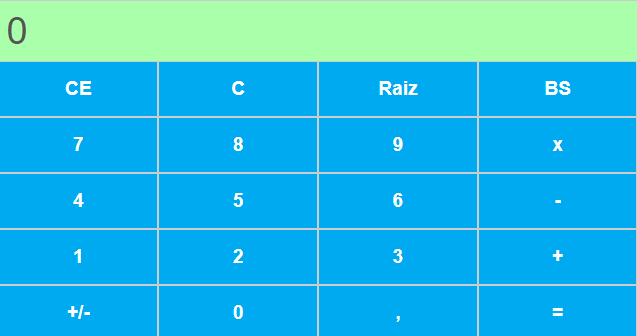

# Projeto de Calculadora

Este é um projeto de desenvolvimento de uma Calculadora com as operações básicas de adição, subtração, divisão e multiplicação

## Stack utilizada

**Front End:** HTML, CSS, JavaScript

## Bibliotecas Utilizadas
- React
## Imagem

## Funcionalidades

- Adição
- Subtração
- Divisão
- Multiplicação
- Raiz Quadrada

